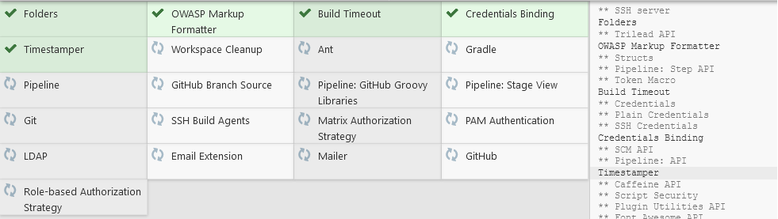
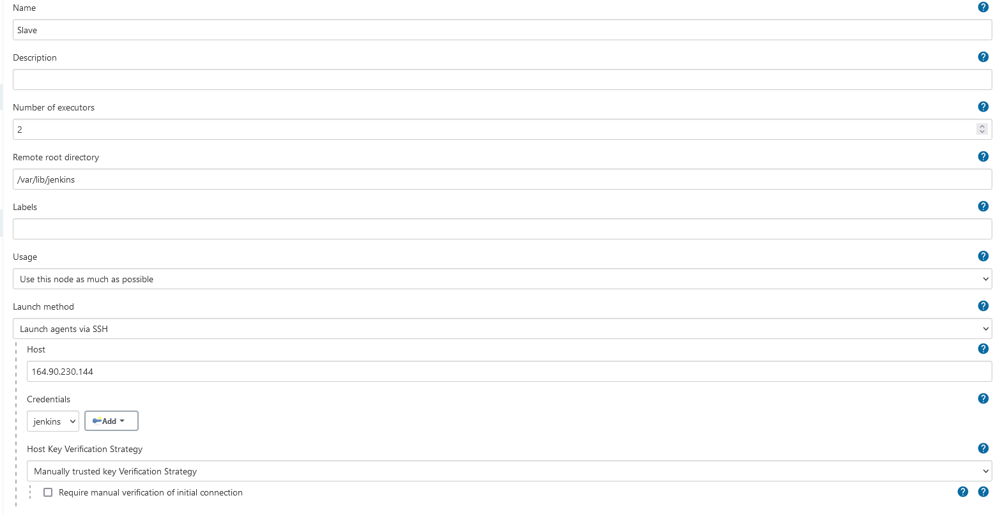
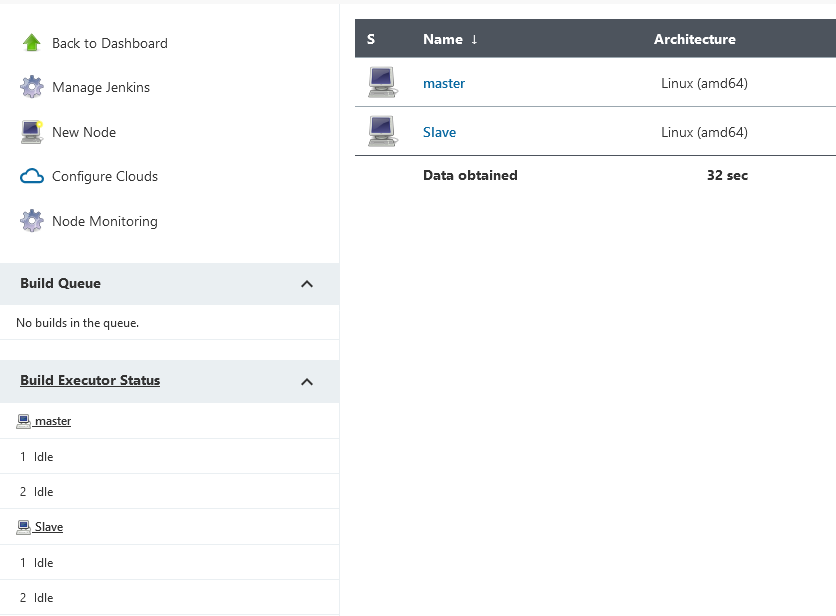
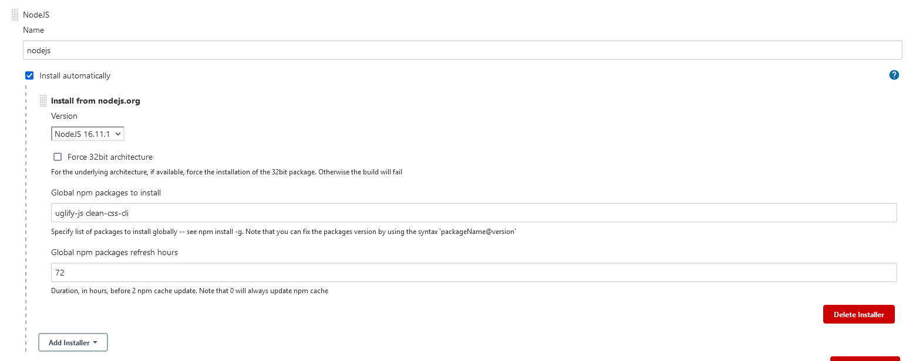
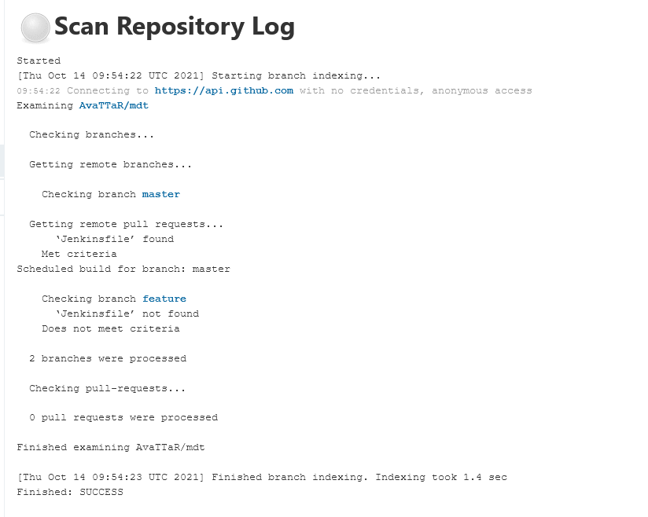
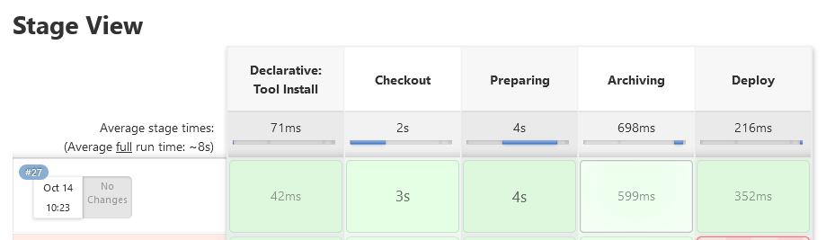

### 1. Create Jenkins VM with internet access:
##### install openjdk-8-jdk, Git
	sudo apt-get install -y openjdk-8-jdk git
##### install Jenkins with enabling autostart on startup
````sh
wget -q -O - https://pkg.jenkins.io/debian-stable/jenkins.io.key | sudo apt-key add - 
sudo sh -c 'echo deb https://pkg.jenkins.io/debian-stable binary/ > /etc/apt/sources.list.d/jenkins.list'
sudo apt-get update
sudo apt-get install -y jenkins 
sudo systemctl daemon-reload
sudo systemctl enable jenkins
sudo systemctl start jenkins
````
##### setup custom port 8081 for Jenkins 

Edit file /etc/default/jenkins `HTTP_PORT=8081`

	sudo systemctl restart jenkins

#####plugins – select plugins, add GitHub and Role-based authorization strategy

#####add new user – jenkins-NAME (your fullname, jenkins-linustorvalds)
User jenkins-iharyefimenka created.
###2. Create Agent VM
#####Install openjdk-8-jre, Git 

	sudo apt-get -y install openjdk-8-jre git 

##### prepare SSH keys
```
sudo adduser jenkins --shell /bin/bash
su jenkins
mkdir /home/jenkins/jenkins_slave
mkdir ~/.ssh && cd ~/.ssh
ssh-keygen -t rsa
cat id_rsa.pub > ~/.ssh/authorized_keys
su root
mkdir /var/lib/jenkins
chown jenkins:jenkins /var/lib/jenkins
```
##### connect agent to master node
Add node using ssh-key from id_rsa 




### 3. Configure tools – NodeJS – 1 

##### Manage Jenkins -> Global tool configuration. Add NodeJS installations with version of NodeJS and global npm packages to install (uglify-js, clean-css-cli)
Install NodeJS plugin and provide configuration:


### 4. Create “Multibranch Pipeline” pipeline job (work inside Lab folder) - 3
folder name – your name in camel case (LinusTorvalds)
Git: fork https://github.com/joashp/material-design-template repo
Write Jenkinsfile which describes declarative pipeline
define NPM tools in pipeline section
Run in parallel stages for compressing JS, CSS files by using next utils:
Uglify-js
clean-css
www/css -> www/min
www/js -> www/min
create tar archive (ignore .git, css and js folders)
archive result



**Check Jenkinsfile**

### 5. Setup the GitHub webhook to trigger the jobs - 2
##### Git plugin - http(s)://JENKINS_URL/git/notifyCommit?url=REPO_URL

##### Enable ‘Poll SCM’ in Job settings

Add triggers { pollSCM('0 0 * * *') } check out Jenkinsfile.

##### GitHub plugin - http(s)://JENKINS_URL/github-webhook/

##### Enable ‘GitHub hook trigger for Git SCM polling’
Add githubPush() to triggers, check out Jenkinsfile.

##### Add githubPush() to the triggers section

Create token on GitHub and add it to creds in Jenkins, next set this credentials to the GitHub plugin settings in Jenkins and enable “manage webhooks” 
Go to GitHub repository into Settings -> Webhooks -> Add Webhook 
Create webhook with url from advanced options of GitHub plugin (http://165.227.129.52:8081/github-webhook/) 
Select Pull and push events as trigers. 

------------

### Use Scripted pipeline instead of declarative

### Spin up VM with installed Artifactory
```
wget -qO - https://api.bintray.com/orgs/jfrog/keys/gpg/public.key | sudo apt-key add - 
echo "deb https://jfrog.bintray.com/artifactory-debs bionic main" | sudo tee /etc/apt/sources.list.d/jfrog.list 
```
Edit /var/lib/apt/lists/jfrog.bintray.com_artifactory-debs_dists_bionic_main_binary-amd64_Packages so only last version remains in it (some issues with repo, is the easiest way to pass it) 
```
sudo apt update
sudo apt install jfrog-artifactory-oss -y
sudo systemctl start artifactory
sudo systemctl enable artifactory
```
### Add new stage for publishing artifacts into Artifactory

Stage deploy added, check out Jenkinsfile.
